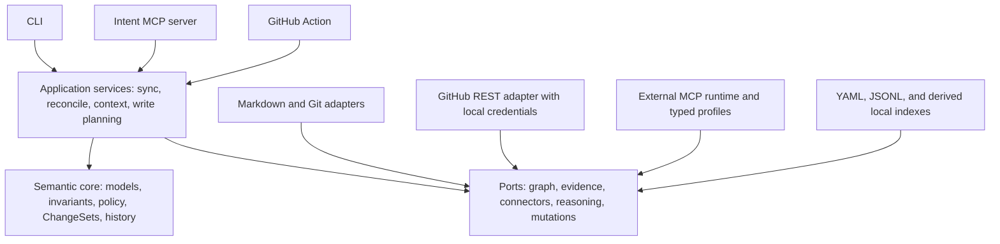

# Intent Engineering Public Alpha Design

Date: 2026-08-25  
Status: Approved in conversation; awaiting written-spec review  
Target: Intent Engineering 0.1 alpha

## 1. Summary

Intent Engineering is a local-first Python tool for preserving and reconciling the chain from source evidence to intent, requirements, code, tests, and outcomes. It maintains a typed, provenance-backed graph and creates evidence-backed reconciliation cases when artifacts disagree. It does not assume that a requirement is always correct or that code is always stale.

This design turns the supplied 0.1.0 starter pack into a working public alpha. It includes the starter's local foundation, working GitHub ingestion using local credentials, an MCP server for coding agents, and an MCP adapter framework for external sources such as Slack, Notion, Jira, and Confluence.

The external MCP adapter framework is read/write, but external writes are never automatic. Every write requires an exact preview and explicit human approval. The approval is bound to the preview's content hash and expires if the target changes.

## 2. Confirmed product decisions

The design records these decisions from discovery:

- Build the broader public alpha rather than only the starter's narrow MVP 0 foundation.
- Use Python 3.12 or newer and publish one installable distribution with the `intent` CLI.
- Keep operation local-first; no hosted account or cloud service is required.
- Authenticate GitHub through local user credentials, using `GH_TOKEN` or an existing GitHub CLI login.
- Expose Intent Engineering itself as an MCP server for coding agents.
- Consume external systems through a shared MCP client runtime and typed provider profiles.
- Ship reference profiles for Slack, Notion, Jira, and Confluence.
- Permit read and write operations through external MCP servers.
- Require a preview and explicit human approval for every external mutation.
- Use YAML as the canonical graph representation behind storage interfaces.
- Keep evidence immutable or version-addressed and keep generated views non-canonical.
- Use Apache-2.0 as the initial repository license because the project is intended as reusable open infrastructure with an explicit patent grant. This can be changed during written-spec review.

## 3. Goals and non-goals

### Goals

The alpha must let a developer:

1. initialize an `.intent/` workspace in an existing Git repository;
2. validate an intent graph and its provenance;
3. ingest Markdown, Git, and GitHub evidence incrementally;
4. ingest external evidence through compatible MCP servers and typed profiles;
5. preserve evidence versions, authorship, source mode, ACL metadata, confidence, and change history;
6. apply semantic mutations only through validated ChangeSets;
7. detect CODE_LAG, REQUIREMENT_LAG, TEST_LAG, UNDOCUMENTED_CODE, and AMBIGUOUS_DIVERGENCE;
8. preserve cross-author incompatibility without overwriting either position;
9. inspect and resolve evidence-backed reconciliation cases;
10. generate concise context packs for tasks and symbols;
11. expose context, explanations, drift, and reconciliation through MCP;
12. preview, approve, and execute guarded writes to external MCP sources;
13. validate the repository's own framework graph with the same engine;
14. run its deterministic tests without a model provider or cloud account.

### Non-goals

The alpha will not include:

- hosted SaaS, billing, dashboards, tenant management, OAuth brokerage, or webhooks;
- universal compatibility with every third-party MCP server;
- autonomous rewriting of code, intent, requirements, tests, or documentation;
- automatic resolution of cross-author disagreement;
- graph database infrastructure;
- a full IDE extension;
- production semantic scoring, embeddings, or opaque truth scores;
- live external-service calls in the default test suite;
- enterprise-scale authorization or organization-wide graphs.

## 4. System architecture

The system is a modular monolith. Entry points share application services and a provider-neutral semantic core. Adapters depend inward on stable ports; the core never imports provider SDKs.



### Architectural rules

- Domain models and policies have no connector, MCP, GitHub, or cloud dependency.
- Storage is interface-driven so a later adapter can replace YAML/JSONL without changing domain semantics.
- LLM-backed reasoning is optional and provider-neutral. It returns structured proposals; it never edits canonical state directly.
- Deterministic code owns content hashing, identity, validation, ChangeSet application, checkpoints, drift state transitions, approvals, and audit records.
- A sync run is idempotent. Replaying identical inputs produces no new evidence version, graph mutation, or duplicate reconciliation case.
- A connector failure is isolated and cannot corrupt canonical state.
- Implementation status remains separate from requirement status and epistemic confidence.

## 5. Repository structure

The repository begins with the supplied foundational documents and evolves into this shape:

```text
intent-engineering/
├── INTENT_ENGINEERING.md
├── CODEX_IMPLEMENTATION.md
├── ROADMAP.md
├── AGENTS.md
├── README.md
├── LICENSE
├── CONTRIBUTING.md
├── pyproject.toml
├── docs/
│   └── superpowers/specs/
├── src/intent_engineering/
│   ├── cli/
│   ├── core/
│   │   ├── models/
│   │   ├── graph/
│   │   ├── provenance/
│   │   ├── confidence/
│   │   ├── history/
│   │   └── policy/
│   ├── storage/
│   │   ├── interfaces.py
│   │   ├── yaml/
│   │   └── jsonl/
│   ├── capture/
│   │   ├── base.py
│   │   ├── markdown/
│   │   ├── git/
│   │   ├── github/
│   │   └── mcp/
│   │       ├── runtime/
│   │       ├── profiles/
│   │       └── bindings/
│   ├── extract/
│   ├── sync/
│   ├── reconcile/
│   ├── context/
│   ├── mutations/
│   ├── render/
│   └── integrations/
│       ├── mcp_server/
│       └── github_action/
├── schemas/
├── profiles/mcp/
│   ├── slack.yaml
│   ├── notion.yaml
│   ├── jira.yaml
│   └── confluence.yaml
├── graph/
├── examples/
├── tests/
│   ├── unit/
│   ├── contract/
│   ├── integration/
│   ├── e2e/
│   └── fixtures/
└── .github/workflows/
```

Packages remain focused:

- `core` owns vocabulary, invariants, graph identity, ChangeSets, audit history, and policies.
- `storage` owns durable local representations behind ports.
- `capture` owns discovery, fetching, normalization, and checkpoints.
- `extract` converts evidence deltas into typed candidate assertions through deterministic or model-backed reasoners.
- `sync` orchestrates incremental ingestion and emits structured run records.
- `reconcile` owns drift observations, detectors, case packets, state transitions, and resolution proposals.
- `context` answers task and symbol queries without dumping the whole graph.
- `mutations` creates previews, records approvals, executes guarded writes, and stores receipts.
- `integrations` exposes the same application services through MCP and GitHub Actions.

## 6. Domain model and invariants

The first-class models are:

- `Graph`, `Node`, `Edge`, and `GraphSnapshot`;
- `EpistemicState` and `ConfidenceChange`;
- `EvidenceRecord`, `EvidenceRef`, and `EvidenceDelta`;
- `ImplementationClaim`;
- `CandidateAssertion` and `ChangeSet`;
- `DriftObservation`;
- `ReconciliationCase`, `ReconciliationEvidenceSide`, and classification history;
- `ProjectConfig` and `SyncCheckpoint`;
- `ContextPack`;
- `WritePlan`, `WriteOperation`, `ApprovalRecord`, and `ExecutionReceipt`.

The starter meta-model remains the initial semantic contract. Known node, edge, status, case, resolution, and change kinds are enums. Extensions use a project-registered, namespaced type declaration; unknown unregistered strings fail validation instead of silently entering the graph.

The engine enforces at least these invariants:

- node and edge IDs are unique;
- internal edges reference existing nodes;
- confidence is between 0.0 and 1.0 and is never treated as completion or priority;
- every material assertion resolves to evidence and provenance;
- an `implemented_baseline` claim includes dated repository evidence and test evidence when applicable;
- semantic mutations are represented by a validated ChangeSet;
- evidence is immutable or version-addressed;
- stable IDs survive non-semantic edits;
- cross-author incompatible positions remain separate and create a reconciliation case;
- generated views never mutate canonical YAML;
- repeated identical sync is a semantic no-op;
- stale implementation mappings can become `stale_evidence`;
- CODE_LAG and REQUIREMENT_LAG are both possible outcomes of requirement/code mismatch.

## 7. Local storage and project workspace

`intent init` creates:

```text
.intent/
├── config.yaml
├── graph.yaml
├── evidence/
├── reconciliation/
├── history/
├── approvals/
└── cache/
```

`graph.yaml` is canonical graph state. Evidence and history are append-only, version-addressed records stored as YAML or JSONL. Reconciliation cases and approvals are durable, auditable records. Cache content is derived and disposable.

Secrets are never written under `.intent/`. Configuration stores environment-variable or external credential-provider references. Projects decide which non-secret `.intent/` paths are committed to Git.

Every graph write uses optimistic concurrency: a ChangeSet names its baseline graph version. Applying a stale ChangeSet fails without partially changing the graph.

## 8. Capture and sync flow

The canonical read path is:

1. Load project configuration and the last committed checkpoint for each source.
2. Discover changed objects.
3. Fetch and normalize each object into a source-neutral record containing stable external ID, source version, author, timestamp, locator, ACL metadata when available, content hash, and payload.
4. Persist the immutable EvidenceRecord.
5. Advance the connector checkpoint only after the evidence write is durable.
6. Compute evidence deltas and extract typed candidate assertions.
7. Resolve semantic identity and build a ChangeSet proposal.
8. Validate the proposal against schema, baseline version, and graph invariants.
9. Apply only policy-permitted low-risk changes; route material or ambiguous changes to review.
10. Run drift detectors and create or update reconciliation cases.
11. Refresh derived context/search indexes and emit a structured sync report.

Duplicate deliveries are deduplicated by connector identity, external ID, source version, and content hash. A partial source failure leaves successful durable evidence intact, does not advance the failed source checkpoint, and marks the overall run partial.

## 9. Connector and MCP profile contracts

All connectors implement discovery, fetch, normalization, and checkpoint behavior and expose stable external IDs, source versions or timestamps, and content hashes.

Local Markdown and Git connectors are deterministic. The GitHub connector reads issues, pull requests, commits, comments, and relevant metadata through the GitHub API using local credentials. Pagination and rate-limit behavior are explicit and retry-safe.

The external MCP adapter has two layers:

1. A shared runtime manages MCP client sessions, supported SDK transports, capability discovery, timeouts, pagination, retries, structured error conversion, and secret-safe logging.
2. Versioned typed profiles describe provider semantics independently of transport.

A profile declares:

- profile identity and version;
- compatible MCP server capabilities;
- read operations for discovery and fetch;
- stable object identity and version fields;
- author, time, locator, parent/thread, and ACL mappings;
- normalization rules into EvidenceRecord fields;
- checkpoint rules;
- allowed write operations and required preconditions;
- exact argument/result schemas and preview rendering rules;
- redaction rules.

Mappings use a constrained declarative selector/transform grammar. They do not execute arbitrary Python or `eval`. A local binding maps a profile's semantic operations to tool/resource names on the user's chosen MCP server. `intent connectors test` validates capabilities and mappings before sync or write operations are enabled.

Reference profiles ship for:

- Slack channels, threads, messages, authors, revisions, posts, replies, and permitted updates;
- Notion pages, blocks, revisions, authors, and permitted page/block updates;
- Jira issues, comments, status/history, and permitted issue/comment updates;
- Confluence pages, versions, comments, authors, and permitted page/comment updates.

These are tested semantic profiles, not a claim of compatibility with every MCP server implementation. Users supply compatible MCP servers, authentication, and any required binding overrides.

## 10. Reconciliation behavior

Drift detection is comparison, not automatic correction. The alpha implements deterministic scaffolding for:

- `CODE_LAG`: a newer active requirement lacks newer implementation evidence;
- `REQUIREMENT_LAG`: newer explicit intent/decision evidence agrees with code/tests against an older requirement;
- `TEST_LAG`: implementation changed after the last verifying test evidence while acceptance criteria remain active;
- `UNDOCUMENTED_CODE`: material code change has no mapped intent, requirement, or decision after configured grace rules;
- `AMBIGUOUS_DIVERGENCE`: meaningful inconsistency exists but evidence is insufficient for a more specific classification.

Every case includes affected graph references, code/test references, evidence on each side, authorship, timestamps, confidence, proposed classification, alternatives, impact, audit history, and whether a human decision is required.

The lifecycle is `open → proposed → needs_human → resolved`, with `deferred` and `false_positive` terminal alternatives. Resolution produces a ChangeSet; it is never an untracked graph edit.

## 11. External write safety

An external write follows this transaction:

1. A human selects or authors a proposed reconciliation resolution.
2. The planner creates an immutable WritePlan containing provider, server binding, exact target, operation, before/after representation, linked evidence, permissions, remote version precondition, and rollback guidance where available.
3. Validation checks project policy, provider profile, permissions, schema, target identity, and current remote version.
4. The CLI displays the full preview. An interactive human approval creates an ApprovalRecord containing actor, timestamp, plan ID, plan content hash, target version, and expiration.
5. The executor refetches the target and verifies the plan hash, approval, permissions, and remote version immediately before the mutation.
6. A mismatch invalidates the approval and performs no write.
7. Execution success or failure becomes an immutable, redacted receipt and new evidence.
8. A successful write resolves or advances the case only through a validated ChangeSet.

No MCP tool can manufacture the human approval it consumes. In the alpha, approval is created through the interactive local CLI. GitHub Actions and unattended sync runs cannot perform external writes.

External writes, material intent/requirement/architecture changes, and cross-author conflict resolutions always require approval. New immutable evidence, durable checkpoints, derived caches, generated views, and explicitly configured low-risk metadata may be applied automatically.

## 12. CLI and MCP server contracts

The CLI exposes:

```text
intent init
intent validate
intent ingest
intent sync
intent drift
intent status
intent explain <id|path|symbol>
intent context --task "<task>" [--format json|markdown]
intent reconcile list
intent reconcile show <case-id>
intent reconcile resolve <case-id>
intent connectors list
intent connectors inspect <connector-id>
intent connectors test <connector-id>
intent write preview <case-or-plan-id>
intent write approve <plan-id>
intent write execute <plan-id>
intent render
intent mcp
intent doctor
```

Commands support structured, versioned JSON output where automation is expected and return documented exit codes.

The Intent MCP server exposes:

- read tools for context, explain, impact, drift, status, validation, and case inspection;
- proposal tools for candidate ChangeSets, reconciliation resolutions, and write previews;
- an execution tool that only accepts a still-valid WritePlan with a separate human ApprovalRecord;
- resources for graph nodes, evidence chains, schemas, case packets, and generated reports;
- prompt templates for task preparation and reconciliation review.

The context-pack contract contains task, relevant intent, requirements, decisions, constraints, acceptance criteria, code refs, test refs, open cases, evidence refs, and warnings. Items preserve stable IDs and confidence where relevant, and relevance limits keep the pack concise.

## 13. Failure handling and observability

- Connector failures are isolated by source and reported as partial syncs.
- Checkpoints advance only after durable evidence persistence.
- Retries reuse stable idempotency keys.
- Stale graph baselines reject ChangeSets.
- Changed remote targets invalidate write approvals.
- Permission failures perform no fallback mutation and keep the case unresolved.
- Model unavailability defers semantic proposals while deterministic capture and validation continue.
- Invalid provider profiles are disabled with actionable diagnostics.
- Secrets and full sensitive source bodies are redacted from logs by default.

Structured sync logs include run ID, project, source checkpoints, evidence added, proposals, applied ChangeSets, cases created or updated, validation failures, per-connector results, and duration.

## 14. Security and privacy

Connectors use least privilege. Each CLI or MCP-server process runs as a configured local actor, and provider bindings may map that actor to external principals. Source ACL metadata is retained where available. Restricted external evidence is returned only when the current actor mapping explicitly permits it; when authorization cannot be resolved, it is excluded from context by default. This is conservative local enforcement, not enterprise RBAC. Configuration also supports source exclusion rules. Secrets are referenced, never stored in the graph, evidence, approvals, or logs.

Write profiles explicitly allowlist operations and argument fields. Preview data is rendered from the exact validated operation. Approval records are hash-bound, time-limited, actor-attributed, and target-version-bound. Execution receipts redact credentials and sensitive transport metadata.

Local-only operation remains possible. External model use is optional and configurable.

## 15. Testing strategy

### Unit tests

Unit tests cover all graph invariants, models, controlled type extensions, evidence immutability, YAML semantic round-trips, ChangeSet validation/application, confidence history, drift rules, context selection, write-plan hashing, approval expiry, and redaction.

### Contract tests

Contract suites exercise every Connector and Store implementation against common behavior. Fake MCP servers validate profile discovery, mapping, pagination, checkpoints, read normalization, write previews, success receipts, permission errors, and changed-target rejection.

### Integration tests

Fixture projects cover:

- aligned intent, requirement, code, and tests;
- code lag;
- requirement lag;
- test lag;
- undocumented code;
- ambiguous divergence;
- cross-author conflict;
- idempotent second sync;
- external MCP write conflict.

GitHub integration tests use a deterministic fake API. Default tests do not need network credentials.

### End-to-end tests

End-to-end tests use temporary Git repositories to exercise initialization, validation, ingestion, sync, drift, reconciliation, context generation, rendering, CLI help, and JSON outputs. They also launch the MCP server over stdio and exercise an approved external write plus invalidation when the target changes.

The repository's framework graph is loaded and validated by the same production loader in CI.

## 16. Public-alpha release gate

The alpha is complete only when:

- tests pass locally and in CI;
- the framework graph validates;
- YAML round-trips without semantic loss;
- evidence versioning and immutability are demonstrated;
- identical sync produces no semantic change;
- CODE_LAG and REQUIREMENT_LAG are produced from distinct evidence patterns;
- all reconciliation cases include evidence references;
- cross-author conflicts preserve both positions;
- CLI help and documented quick-start commands execute successfully;
- deterministic operation requires no model or cloud account;
- GitHub ingestion works with local credentials;
- the stdio Intent MCP server returns context and explanations;
- Slack, Notion, Jira, and Confluence profiles pass fake-server contract tests;
- an external write succeeds only after a matching human approval;
- a changed target invalidates approval and causes no mutation;
- generated views do not change canonical graph state;
- incomplete items are reported explicitly rather than hidden behind a completion claim.

## 17. Delivery slices

Implementation is organized into three sequential, independently verifiable slices:

1. **Core local engine:** repository skeleton, domain models, schemas, stores, ChangeSets, local connectors, sync, drift, reconciliation, context, CLI, fixtures, and dogfood validation.
2. **GitHub integration:** local authentication, issues/PRs/commits ingestion, checkpoints, failure handling, and GitHub Action reporting.
3. **MCP and guarded write-back:** Intent MCP server, external client runtime, typed profiles and bindings, write plans, CLI approval, execution receipts, and provider contract tests.

Each slice must preserve the domain and storage boundaries. Later slices extend ports and adapters rather than changing core semantics.

## 18. Documentation and compatibility

The README explains the problem, Capture → Manage → Sync → Reconcile loop, local quick start, example drift cases, agent use, local credentials, MCP configuration, and why the engine does not presume that requirements are truth.

Machine-readable schemas, context outputs, profiles, and MCP tool arguments are versioned. Breaking contract changes require an explicit schema version and migration path. Generated Markdown and Mermaid remain views, never canonical state.
